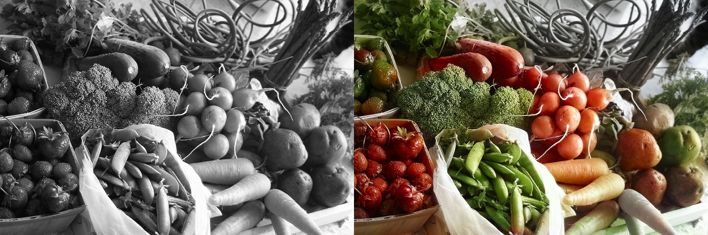

# Image-Classification-as-a-Task-Transfer
An AI model for image classification pre-trained on image colorization

The goal of this project is discovering if a colorization model cann be used for image classification through task transfer. 

We used existing models, trained on image colorization:
https://github.com/ericsujw/InstColorization

The credited above project has 3 models: the instance model, which uses [Detectron2](https://github.com/facebookresearch/detectron2) for image recognition for better colorization (Detectron2 will not be used for image classification), the full model, which colorizes the full image, and the fusion model, which colorizes the boxes of recognized objects and the full image separately, then "fuses" them. 

