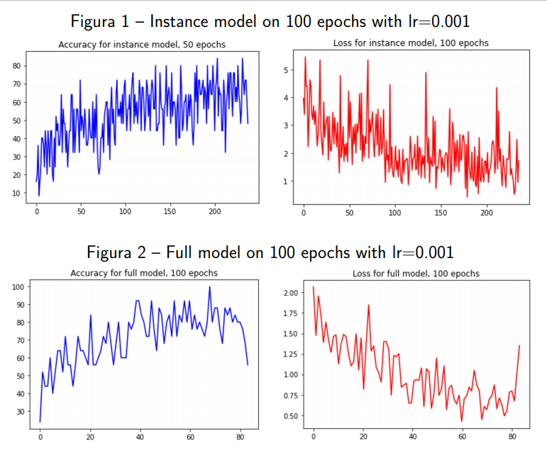

# Image-Classification-as-a-Task-Transfer
An AI model for image classification pre-trained on image colorization

The goal of this project is discovering if a colorization model cann be used for image classification through task transfer. 

We used existing models, trained on image colorization:
https://github.com/ericsujw/InstColorization

The credited above project has 3 models: the instance model, which uses [Detectron2](https://github.com/facebookresearch/detectron2) for image recognition for better colorization (Detectron2 will not be used for image classification), the full model, which colorizes the full image, and the fusion model, which colorizes the boxes of recognized objects and the full image separately, then "fuses" them. 

Our experiment will be based on the instance and full models.

We used a fruits and vegetables [dataset](https://www.kaggle.com/kritikseth/fruit-and-vegetable-image-recognition), and kept 10 different classes for training and testing. 

After training the new models on image classification, we obtained these training results:

The accuracy is very uneven (randomly anywhere between 40 and 80 towards the end for the instance model), we suppose because the models are using color for classification, and we have some classes with the same color (for example banana, pineapple, and lemon). The pictures are picked randomly in batches of 25. The accuracy could be lower when more pictures of said classes are picked.

